# SwarmOps Architecture

## Overview

SwarmOps orchestrates parallel AI agent workers to build software projects through a multi-phase pipeline. The system manages:
- Role-based agent spawning with configurable models and thinking levels
- Task decomposition with dependency tracking (`progress.md` task graph)
- Parallel worker execution with git worktree isolation
- Sequential multi-role review chain (reviewer -> security-reviewer -> designer)
- Retry logic with exponential backoff and circuit breaker
- Escalation to humans when automation fails

**Tech Stack:**
- **Framework**: Nuxt 4 (Vue 3) with Nitro server
- **AI Gateway**: OpenClaw Gateway (local HTTP API at `http://127.0.0.1:18789`)
- **Data Storage**: JSON/JSONL files in `/home/siim/swarmops/data/orchestrator/`
- **Projects**: Git repos in `/home/siim/swarmops/projects/{name}/`
- **Worker Isolation**: Git worktrees in `/tmp/swarmops-worktrees/`

---

## Pipeline Flow

```mermaid
flowchart TB
    subgraph phase1[" 1. PROJECT CREATION "]
        A[📁 New Project]
        A --> B[state.json created]
    end
    
    subgraph phase2[" 2. INTERVIEW "]
        B --> C[🤖 Interview Agent]
        C --> D{Requirements<br/>Gathered?}
        D -->|No| C
        D -->|Yes| E[interview.json<br/>complete: true]
    end
    
    subgraph phase3[" 3. SPECIFICATION "]
        E --> F[🏗️ Architect Agent]
        F --> G[Design Solution]
        G --> H[📋 Task Decomposer]
        H --> I[IMPLEMENTATION_PLAN.md<br/>+ progress.md tasks]
    end
    
    subgraph phase4[" 4. BUILD "]
        I --> J[Parse Task Graph]
        J --> K{Ready Tasks?}
        K -->|Yes| L[🔨 Spawn Workers]
        L --> M[Worker 1<br/>git worktree]
        L --> N[Worker 2<br/>git worktree]
        L --> O[Worker N<br/>git worktree]
        M & N & O --> P[Task Complete<br/>Callback]
        P --> K
        K -->|No tasks left| Q[All Tasks Done ✓]
    end
    
    subgraph phase5[" 5. REVIEW "]
        Q --> R[👀 Code Reviewer]
        R -->|approve| S[🔒 Security Reviewer]
        R -->|fix needed| T[🔧 Fixer Agent]
        T --> R
        S -->|approve| U{Frontend<br/>Changes?}
        S -->|fix needed| T
        U -->|Yes| V[🎨 Design Reviewer]
        U -->|No| W[All Approved ✓]
        V -->|approve| W
        V -->|fix needed| T
    end
    
    subgraph phase6[" 6. COMPLETE "]
        W --> X[Merge to Main]
        X --> Y((🎉 Done))
    end
    
    style A fill:#3b82f6,stroke:#2563eb,color:#fff
    style C fill:#8b5cf6,stroke:#7c3aed,color:#fff
    style F fill:#8b5cf6,stroke:#7c3aed,color:#fff
    style L fill:#6366f1,stroke:#4f46e5,color:#fff
    style R fill:#f59e0b,stroke:#d97706,color:#fff
    style S fill:#f59e0b,stroke:#d97706,color:#fff
    style V fill:#f59e0b,stroke:#d97706,color:#fff
    style Y fill:#10b981,stroke:#059669,color:#fff
```



### Phase Summary

| Phase | Agent Roles | Completion Criteria | Next Phase |
|-------|-------------|---------------------|------------|
| Interview | interview agent | `interview.json` has `complete: true` | Spec |
| Spec | architect + task-decomposer | `specs/IMPLEMENTATION_PLAN.md` exists | Build |
| Build | builder (per task role) | All tasks in `progress.md` marked done | Review |
| Review | reviewer -> security-reviewer -> designer (conditional) | Full review chain approves | Merge/Complete |

---

## Core Subsystems

### 1. Role Loader (`role-loader.ts`)

Dynamic role configuration system. Roles define which model, thinking level, and instructions each agent type uses.

**Data Source**: `/home/siim/swarmops/data/orchestrator/roles.json`

**Interface:**
```typescript
interface RoleConfig {
  id: string            // e.g., "builder", "architect", "security-reviewer"
  name: string
  model?: string        // e.g., "anthropic/claude-opus-4-5"
  thinking?: string     // "low" | "medium" | "high"
  instructions?: string // Role-specific system prompt
  promptFile?: string   // Path to external prompt file
  description?: string
}
```

**Key Functions:**
- `getRoleConfig(roleId)` -- returns role config with model/thinking/instructions
- `loadRoles()` -- loads from disk with 30s in-memory cache
- `invalidateRoleCache()` -- clears cache (called on role CRUD operations)

**Pipeline Roles:**
| Role | Default Model | Thinking | Used In |
|------|--------------|----------|---------|
| architect | Claude Opus 4 | high | Spec phase |
| task-decomposer | Claude Opus 4 | high | Spec phase |
| builder | Claude Sonnet 4 | low | Build phase |
| reviewer | Claude Opus 4 | high | Review chain |
| security-reviewer | Claude Opus 4 | high | Review chain |
| designer | Claude Sonnet 4 | medium | Review chain (conditional) |

---

### 2. Task Graph Orchestrator (`orchestrator.ts`)

Parses and manages task dependencies from `progress.md`.

**Interfaces:**
```typescript
interface GraphTask {
  id: string
  title: string
  done: boolean
  depends: string[]   // IDs of dependency tasks
  role: string        // Any role string from @role() annotation
  line: number        // Line number in progress.md
}

interface TaskGraph {
  tasks: Map<string, GraphTask>
  order: string[]     // Topological sort order
}
```

**Task Format in `progress.md`:**
```markdown
- [ ] Implement auth module @id(auth-module) @depends(db-setup) @role(builder)
- [ ] Review security @id(security-check) @role(security-reviewer)
- [x] Database setup @id(db-setup) @role(builder)
```

**Key Functions:**
- `parseTaskGraph(progressMd)` -- parses markdown annotations into task graph
- `getReadyTasks(graph)` -- returns tasks with all deps satisfied and not done
- `getParallelGroups(graph)` -- groups tasks that can run simultaneously
- `markTaskDone(projectPath, taskId)` -- updates progress.md checkbox

**Design Note:** The `role` field accepts any string (widened from binary `builder|reviewer`). This maps to role configs in `roles.json`.

---

### 3. Auto-Advance System (`auto-advance.ts`)

Orchestrates phase transitions and spawns phase-specific agents.

**Spec Phase:**
1. Loads `architect` and `task-decomposer` roles via `getRoleConfig()`
2. Builds combined prompt with both role instructions
3. Spawns using architect's model and thinking settings
4. Prompt includes available `@role()` values for task annotations

**Build Phase:**
1. Parses `progress.md` -> task graph
2. For each ready task: loads role config via `getRoleConfig(task.role || 'builder')`
3. Creates git worktree per worker
4. Spawns workers with staggered 3s delay, using each task's role model/thinking

**Review Phase:**
- Calls `startReviewChain()` from phase-reviewer

---

### 4. Phase Reviewer (`phase-reviewer.ts`)

Sequential multi-role code review system.

**Review Chain:**
1. **reviewer** (always) -- general code quality review
2. **security-reviewer** (always) -- security-focused review
3. **designer** (conditional) -- only if frontend files changed

**Key Functions:**
- `startReviewChain(opts)` -- builds chain, checks frontend changes, spawns first reviewer
- `advanceReviewChain(runId, phaseNumber, approvedRole)` -- moves to next reviewer
- `resetReviewChain(runId, phaseNumber)` -- resets to first reviewer after fixes
- `getReviewChainState(runId, phaseNumber)` -- returns chain/index/approvals/remaining
- `hasChangedFrontendFiles(repoDir, phaseBranch, targetBranch)` -- git diff for frontend files

**Decision Flow:**

```mermaid
flowchart TB
    A[👀 Reviewer Evaluates Code] --> B{Decision?}
    
    B -->|✅ Approve| C{Last in Chain?}
    C -->|Yes| D((🎉 Merge<br/>to Main))
    C -->|No| E[➡️ Next Reviewer]
    E --> A
    
    B -->|🔧 Request Fix| F[Spawn Fixer Agent]
    F --> G[Fix Applied]
    G --> H[Reset Chain to Start]
    H --> A
    
    B -->|⚠️ Escalate| I[Human Review Queue]
    I --> J{Human Decision}
    J -->|Approve| D
    J -->|Fix| F
    
    style D fill:#10b981,stroke:#059669,color:#fff
    style I fill:#f59e0b,stroke:#d97706,color:#fff
    style F fill:#6366f1,stroke:#4f46e5,color:#fff
```



---

### 5. Gateway Client (`gateway-client.ts`)

OpenClaw Gateway integration with spawn safeguards.


**Safeguards:**
1. **Circuit Breaker** -- 5 consecutive failures opens circuit (60s cooldown)
2. **Rate Limiting** -- max 5 concurrent spawns per 20s window
3. **Unique Labels** -- auto-appends timestamp to prevent collisions
4. **Exponential Backoff** -- automatic delays on failures

---

### 6. Supporting Subsystems

| Module | Purpose |
|--------|---------|
| `spawn-guard.ts` | Circuit breaker preventing runaway session storms |
| `review-state.ts` | Persistent review tracking per phase |
| `phase-collector.ts` | Tracks parallel workers, triggers merge when all complete |
| `phase-merger.ts` | Sequential merge of worker branches into phase branch |
| `conflict-resolver.ts` | AI-powered merge conflict resolution |
| `task-registry.ts` | Prevents duplicate task spawns |
| `worktree-manager.ts` | Git worktree creation for parallel isolation |
| `retry-handler.ts` | Per-task retry with exponential backoff |
| `ledger-writer.ts` | Append-only event log (ledger.jsonl) |
| `worker-tracker.ts` | Polls gateway to detect worker completion |

---

## API Endpoints

### Project Endpoints

| Method | Path | Purpose |
|--------|------|---------|
| POST | `/api/projects/{name}/orchestrate` | Spawn workers for ready tasks |
| POST | `/api/projects/{name}/task-complete` | Handle worker completion |
| POST | `/api/projects/{name}/spec-complete` | Mark spec phase done |
| POST | `/api/projects/{name}/interview` | Handle interview messages |

### Orchestrator Endpoints

| Method | Path | Purpose |
|--------|------|---------|
| POST | `/api/orchestrator/review-result` | Receive review decisions (chain-aware) |
| POST | `/api/orchestrator/merge-phase` | Trigger phase merge |
| POST | `/api/orchestrator/fix-complete` | Handle fixer completion |
| GET/POST | `/api/orchestrator/spawn-guard` | Circuit breaker status/reset |
| GET | `/api/orchestrator/workers` | List active workers |
| GET | `/api/orchestrator/ledger` | Query event log |

### Role Management

| Method | Path | Purpose |
|--------|------|---------|
| GET | `/api/orchestrator/roles` | List all roles |
| POST | `/api/orchestrator/roles` | Create role (invalidates cache) |
| PUT | `/api/orchestrator/roles/{id}` | Update role (invalidates cache) |
| DELETE | `/api/orchestrator/roles/{id}` | Delete role (invalidates cache) |

---

## Data Structures

### Project Directory
```
/home/siim/swarmops/projects/{name}/
+-- state.json              # Phase/status tracking
+-- interview.json          # Interview messages
+-- progress.md             # Task graph with @id/@depends/@role
+-- activity.jsonl          # Per-project event log
+-- specs/
    +-- IMPLEMENTATION_PLAN.md
```

### Orchestrator State
```
/home/siim/swarmops/data/orchestrator/
+-- roles.json              # Role configurations
+-- ledger.jsonl            # System-wide event log
+-- task-registry.json      # Task deduplication state
+-- retry-state.json        # Per-task retry tracking
+-- escalations.json        # Human escalation queue
+-- project-runs/*.json     # Active run state per project
+-- phases/*.json           # Phase execution state
+-- reviews/*.json          # Review chain state per phase
```

### Git Branch Structure
```
main (target branch)
+-- swarmops/{runId}/phase-1        (phase branch)
|   +-- swarmops/{runId}/worker-1   (worker branch)
|   +-- swarmops/{runId}/worker-2
+-- swarmops/{runId}/phase-2
    +-- ...
```

---

## Key Design Patterns

1. **Role-Based Agent Config** -- Model, thinking, and instructions per role via `getRoleConfig()`
2. **Sequential Review Chain** -- Multiple reviewers in sequence; chain resets fully on fix
3. **Staggered Parallel Execution** -- 3s delay between worker spawns
4. **Phase-Based Git Isolation** -- Separate branches per phase and per worker
5. **Server-Side State** -- Workers don't update progress.md; server marks tasks done
6. **Circuit Breaker** -- Stops spawns after consecutive failures
7. **Retry with Escalation** -- Exponential backoff per task, human escalation when exhausted
