# SwarmOps Documentation

Welcome to the SwarmOps documentation. SwarmOps is a distributed orchestration platform for managing AI agent workflows, pipelines, and multi-worker coordination.

## Quick Links

- [Architecture](?page=architecture) — System design, data flow, and core subsystems
- [Agent Context](?page=agent-context) — Role-based spawning, prompts, and isolation
- [Operations](?page=operations) — Running, debugging, and maintenance
- [Resilience](?page=resilience) — Retry, circuit breaker, and escalation patterns
- [API Reference](?page=api) — REST API endpoints and usage
- [Agent Memory](?page=agent-memory) — Memory and context management

## Overview

```mermaid
flowchart TB
    subgraph ui[" 🖥️ DASHBOARD "]
        A[Web Interface]
        B[REST API]
        A <--> B
    end
    
    subgraph orch[" ⚙️ ORCHESTRATION "]
        C[Phase Watcher<br/>Auto-advances phases]
        D[Task Registry<br/>Prevents duplicates]
        E[Spawn Guard<br/>Rate limiting]
    end
    
    subgraph exec[" 🤖 EXECUTION "]
        F[OpenClaw Gateway]
        G[Worker 1]
        H[Worker 2]
        I[Worker N]
        F --> G & H & I
    end
    
    subgraph data[" 💾 STORAGE "]
        J[(Projects)]
        K[(Ledger)]
        L[(Roles)]
    end
    
    B --> C & D & E
    C & D & E --> F
    C & D & E --> J & K & L
    
    style A fill:#10b981,stroke:#059669,color:#fff
    style F fill:#6366f1,stroke:#4f46e5,color:#fff
    style C fill:#f59e0b,stroke:#d97706,color:#fff
```

SwarmOps provides a unified dashboard for:

- **Project Management** — Create and monitor orchestration projects
- **Worker Coordination** — Manage distributed workers across nodes
- **Pipeline Execution** — Define and run multi-step AI pipelines
- **Real-time Monitoring** — Track task progress and system health
- **Role-Based Agents** — Configure model, thinking level, and instructions per role

## Key Concepts

### Projects

A project is a container for related orchestration tasks. Each project has its own:

- Task queue and execution history
- Worker assignments
- Pipeline definitions
- Ledger of all operations

### Roles

Roles define agent behavior:

| Role | Purpose | Model | Thinking |
|------|---------|-------|----------|
| architect | System design | Opus 4 | high |
| task-decomposer | Break specs into tasks | Opus 4 | high |
| builder | Implement code | Sonnet 4 | low |
| reviewer | Code quality review | Opus 4 | high |
| security-reviewer | Security review | Opus 4 | high |
| designer | UI/UX review | Sonnet 4 | medium |

### Workers

Workers are execution units that process tasks. They can run:

- Locally on the same machine as the orchestrator
- In isolated git worktrees for parallel execution
- With role-specific model and thinking configuration

### Pipelines

Pipelines define multi-phase workflows:

```mermaid
flowchart TB
    I[📋 Interview<br/>Gather requirements] 
    I --> S[🏗️ Spec<br/>Design + decompose]
    S --> B[🔨 Build<br/>Parallel workers]
    B --> R[👀 Review<br/>Multi-role chain]
    R --> M[🔀 Merge<br/>Git integration]
    M --> C((✅ Complete))
    
    style I fill:#3b82f6,stroke:#2563eb,color:#fff
    style S fill:#8b5cf6,stroke:#7c3aed,color:#fff
    style B fill:#6366f1,stroke:#4f46e5,color:#fff
    style R fill:#f59e0b,stroke:#d97706,color:#fff
    style M fill:#10b981,stroke:#059669,color:#fff
    style C fill:#10b981,stroke:#059669,color:#fff
```

Each phase spawns appropriate agents based on role configuration.

### Ledger

The ledger maintains an immutable record of all operations, providing:

- Complete audit trail
- Task replay capability
- Debugging history

## Getting Started

1. **Create a project** from the dashboard or via API
2. **Configure roles** with appropriate models and thinking levels
3. **Start the pipeline** — interview, spec, build phases run automatically
4. **Monitor progress** through the real-time dashboard

## System Requirements

- Node.js 18+ (for local workers)
- 2GB RAM minimum
- OpenClaw Gateway running locally

---

For detailed technical information, see the [Architecture](?page=architecture) documentation.
