# Resilience Patterns in SwarmOps

Multiple layers of resilience handle failures without overwhelming resources or creating infinite loops.

```mermaid
flowchart TB
    subgraph layer1[" 🛡️ LAYER 1: Task Registry "]
        A[Spawn Request] --> B{Already<br/>Running?}
        B -->|Yes| X1[❌ SKIP<br/>Duplicate prevented]
        B -->|No| C{Already<br/>Completed?}
        C -->|Yes| X2[❌ SKIP<br/>Already done]
        C -->|No| NEXT1[✓ Pass]
    end
    
    subgraph layer2[" ⚡ LAYER 2: Spawn Guard "]
        NEXT1 --> D{Circuit<br/>Open?}
        D -->|Yes| X3[🚫 BLOCKED<br/>Wait 60s cooldown]
        D -->|No| E{Rate<br/>Limit Hit?}
        E -->|Yes| X4[⏳ WAIT<br/>Max 5 per 20s]
        E -->|No| NEXT2[✓ Pass]
    end
    
    subgraph layer3[" 🚀 LAYER 3: Execution "]
        NEXT2 --> F[Register Task]
        F --> G[Spawn Worker]
        G -->|Success| H((✅ Running))
        G -->|Fail| I{Retries<br/>Left?}
        I -->|Yes| J[Backoff Delay]
        J --> G
        I -->|No| K[Open Circuit]
        K --> L[⚠️ Escalate<br/>Human needed]
    end
    
    style H fill:#10b981,stroke:#059669,color:#fff
    style X1 fill:#94a3b8,stroke:#64748b,color:#fff
    style X2 fill:#94a3b8,stroke:#64748b,color:#fff
    style X3 fill:#ef4444,stroke:#dc2626,color:#fff
    style X4 fill:#f59e0b,stroke:#d97706,color:#fff
    style L fill:#f59e0b,stroke:#d97706,color:#fff
```



## Layer 1: Task Registry (Deduplication)

**Problem:** Same task spawned multiple times due to race conditions.
**Solution:** Track task states in `task-registry.json`. Running/completed tasks are skipped. Stale tasks (>1hr) auto-cleared.

## Layer 2: Retry Handler (Per-Task Limits)

**Problem:** Tasks fail and need retry, but shouldn't retry forever.
**Solution:** Per-task retry tracking with exponential backoff.

- **Config:** 3 attempts, 5s base delay, 2x backoff, 60s max
- **Key design:** Unique retry key per task: `phaseNumber * 100000 + hashTaskId(taskId)`
- **States:** pending -> retrying -> exhausted (needs human) or succeeded
- **Backoff:** 5s -> 10s -> 20s, with +/-10% jitter

## Layer 3: Spawn Guard (Circuit Breaker)

**Problem:** Gateway issues cause spawn storm.
**Solution:** Circuit opens after 5 consecutive failures (60s cooldown). Rate limit: 5 spawns per 20s window.

## Layer 4: Review Chain Resilience

**Problem:** Multi-reviewer chain can fail at any point.
**Solution:**
- Reviewer approves -> advance to next reviewer
- Reviewer requests fix -> reset chain to first reviewer, spawn fixer
- Fix complete -> re-review from start (all reviewers re-check)
- 3 fix cycles exhausted -> escalate to human
- Designer review is conditional on `hasChangedFrontendFiles()`

**Chain resets ensure fixes are always re-reviewed by all roles.**

## Layer 5: Escalation (Human in the Loop)

**Triggers:** Retry exhaustion, circuit breaker exhaustion, unresolvable conflicts, review fix limit exceeded.
**Behavior:** Escalated tasks skipped by orchestrator. UI shows list. Human resolves to continue.

## Layer 6: Staggered Spawning

**Problem:** Simultaneous spawns overwhelm gateway.
**Solution:** 3-second delay between worker spawns.

## Layer 7: Role-Based Model Selection

**Problem:** Wrong model wastes resources or produces poor results.
**Solution:** Each role has configured model and thinking level:
- High-stakes (architect, reviewer, security): Opus with high thinking
- Implementation (builder): Sonnet with low thinking
- Design (designer): Sonnet with medium thinking
- Configurable via `roles.json` without code changes

## Failure Flow

```mermaid
flowchart TB
    A[❌ Task Fails] --> B{Attempts < 3?}
    B -->|Yes| C[Calculate Backoff<br/>5s × 2^attempt]
    C --> D[⏳ Wait]
    D --> E[🔄 Retry Task]
    E -->|Success| F((✅ Done))
    E -->|Fail| A
    
    B -->|No| G[Status: Exhausted]
    G --> H[Create Escalation]
    H --> I[⚠️ Human Review<br/>Required]
    
    style F fill:#10b981,stroke:#059669,color:#fff
    style I fill:#f59e0b,stroke:#d97706,color:#fff
```



### Review Fix Cycle

```mermaid
flowchart TB
    A[👀 Reviewer:<br/>Request Changes] --> B[Reset Review Chain]
    B --> C[🔧 Spawn Fixer Agent]
    C --> D[Fix Applied + Committed]
    D --> E{Fix Cycles < 3?}
    E -->|Yes| F[Re-review from Start<br/>All reviewers again]
    F --> G{All Approve?}
    G -->|Yes| H((✅ Merge<br/>to Main))
    G -->|No, fix needed| A
    
    E -->|No, exhausted| I[⚠️ Escalate<br/>to Human]
    
    style H fill:#10b981,stroke:#059669,color:#fff
    style I fill:#f59e0b,stroke:#d97706,color:#fff
    style C fill:#6366f1,stroke:#4f46e5,color:#fff
```



## Clearing State

```bash
rm /home/siim/swarmops/data/orchestrator/retry-state.json
rm /home/siim/swarmops/data/orchestrator/task-registry.json
rm /home/siim/swarmops/data/orchestrator/escalations.json
curl -X POST http://localhost:3939/api/orchestrator/spawn-guard -d '{"action":"reset"}'
```

## Lessons Learned

1. Unique retry keys per task -- shared state causes premature exhaustion
2. Stagger spawns -- simultaneous spawns overwhelm gateway
3. Circuit breaker is essential -- prevents cascade failures
4. Review chain resets fully -- partial re-review misses issues
5. Human escalation is the final net -- automation should know when to stop
6. Role-based models -- match capability to task complexity
7. Cache invalidation on role changes -- 30s cache must be cleared on CRUD
